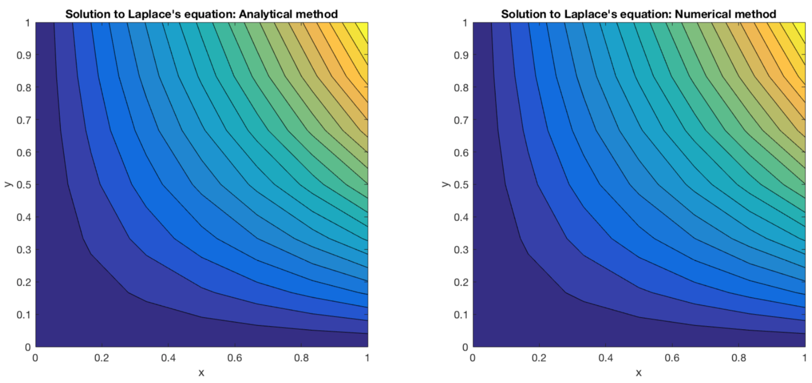
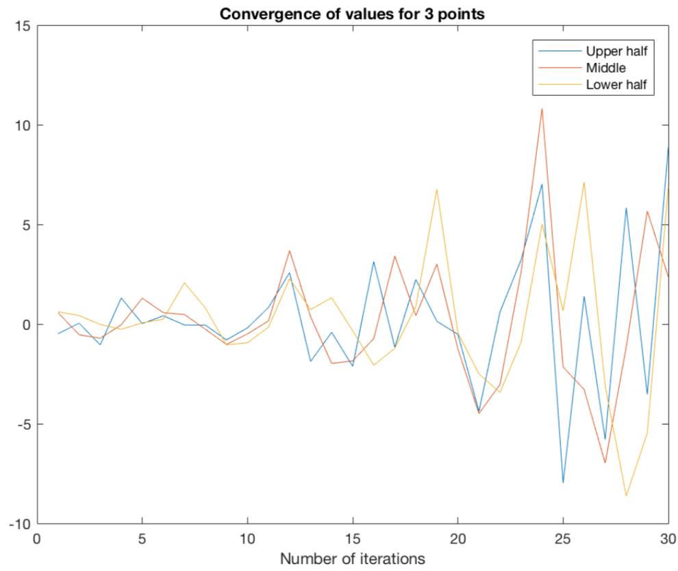

## Solving Laplace's equation for an electrostatic problem over a rectangular domain using the successive over-relaxation method.
It also works for calculating the electric potential for a collection of point charges &amp; can simulate fluid flow too.

First solving for the following boundary conditions (as these have a simple analytic solution)

ψ = 0 on x = 0 and 0 ≤ y ≤ 1;          ψ = sin x sinh 1 on y = 1 and 0 ≤ x ≤ 1;
ψ = 0 on y = 0 and 0 ≤ x ≤ 1;          ψ = sin 1 sinh y on x = 1 and 0 ≤ y ≤ 1

 

Convergence rates are calculated for different values of the over-relaxation parameter. Above ⍺ = 2.1 (graph on the right) 
the solution doesn't converge anymore. The optimal value is ⍺ = 1.35 (graph on the left).

 

Poisson's equation can be solved in this grid for static charges too. 
 

Using the same method, we can also solve for irrotational fluids. 

 
